# Product Card Technical Assessment

Custom Shopify product card built from scratch in Dawn with TailwindCSS.

## Current Functionality

- Pixel-focused product card layout based on the provided <a href="https://www.figma.com/design/8OoguRzaKPQU6AxxyjNDrQ/FE-Technical-Assessment?node-id=0-1&p=f&t=xJ9ClvL2mAmWT1I8-0" target="_blank" rel="noopener noreferrer">Figma design</a>.

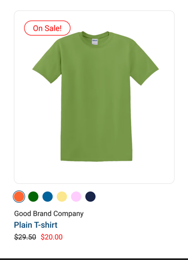

- Sale badge supports both automatic sale detection (`compare_at_price > price`) and manual control via metafields:
  - `custom.sale_badge_text` (single line text): `Sale!` (default), examples: `Limited Offer`, `Final Sale`
  
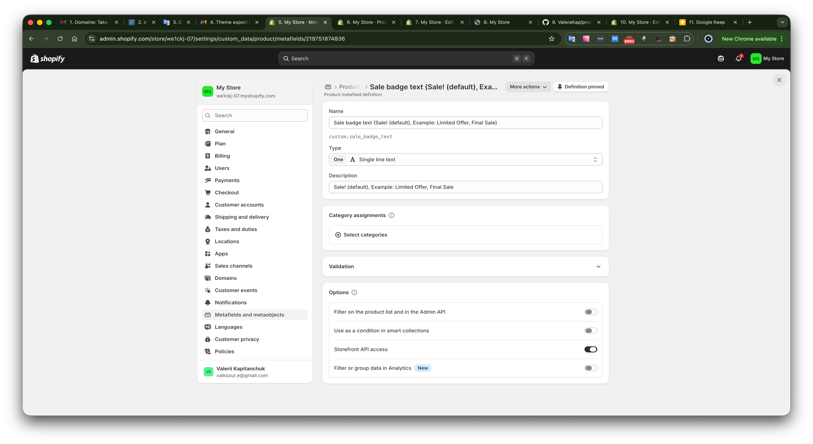

  - `custom.sale_badge_mode` (single line text): `default`, `force_show`, `force_hide`
  - `custom.sale_badge_enabled` (boolean, legacy fallback): manual/forced badge activation even if there is no `compare_at_price` when mode is `default`

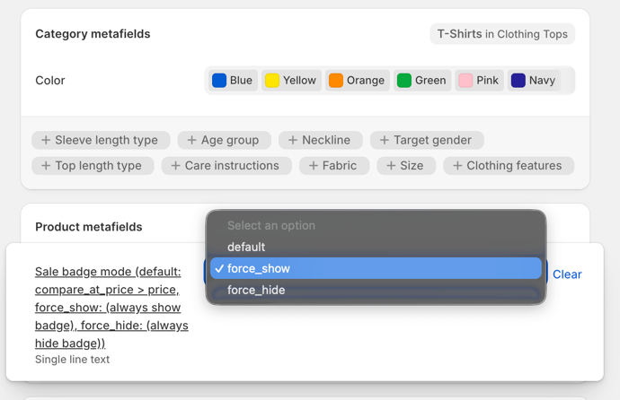
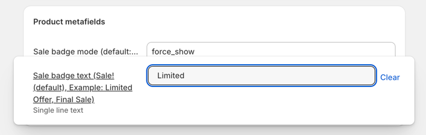

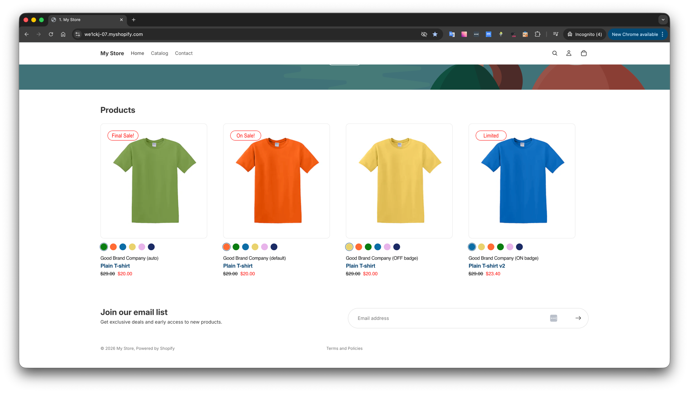

- Variant swatches support desktop hover preview and click-to-commit behavior:
  - hover on desktop previews variant image/price/url
  
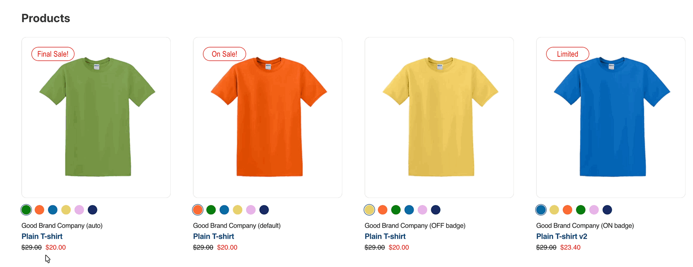

  - click fixes the selected variant state
  - on touch devices, a horizontal swipe on the product image switches color variants (left/right), tested on iPhone

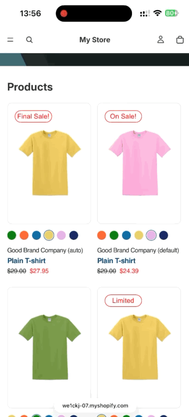

- UX polish (modern interaction layer):
  - swatches include subtle pulse feedback on hover (non-active only) to guide interaction
  - color tooltip appears on swatch hover/focus for faster variant recognition

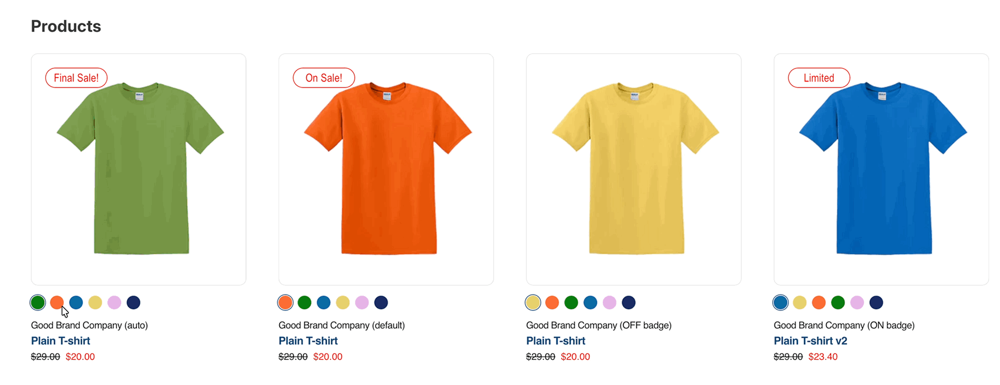

  - swatches wrap to a new line automatically when there are many color values
  - on very small screens (`<390px`), swatch size is reduced for cleaner layout fit
  - transitions are tuned to feel responsive and lightweight without visual noise
- Sale badge/label includes a subtle Tailwind-based hover animation for desktop interactions.
- Sale badge includes a lightweight interaction hint added **intentionally as a demo of potential future functionality** (beyond the assessment scope):
  - cursor changes to pointer on hover
  - click shows a compact tooltip indicating that the badge can be connected to a promo/category URL in a future iteration
  - tooltip is rendered as a fixed overlay (outside image clipping) with adaptive top/bottom placement and auto-dismiss
  - > **Note:** this tooltip is a deliberate preview of what badge click-through behavior could look like (e.g. linking to a sale collection or filtered listing). It is not part of any AC and can be removed or replaced with a real URL in a production iteration.
- Badge/label click-through behavior (for example, linking to a collection, filtered listing, or tag group page) is feasible as a next iteration, but was intentionally left out because it was not required in the assessment scope.
- Internationalization-ready: static UI labels use locale translation keys (`| t`), and configurable metafield text can be localized via Shopify localization tools.
- SEO/accessibility image handling: product images always receive a non-empty `alt` with fallbacks (`media alt -> product title -> localized "Product image"`), including after swatch-based variant switching.
- Responsive behavior: product list/grid is configured to display 2 cards on small screens and 3 cards on tablet widths, with desktop layout preserved.
- Performance-oriented image delivery: product images use lazy loading, intrinsic dimensions (`width`/`height`), `decoding="async"`, and responsive `srcset/sizes` (also updated on variant switch) to reduce payload and improve PageSpeed.
- Product text supports display fallbacks for heading/title (including product type and optional metafields).
- `Plain T-shirt` is currently sourced from `Product type`; if needed, this can be overridden via metafields.

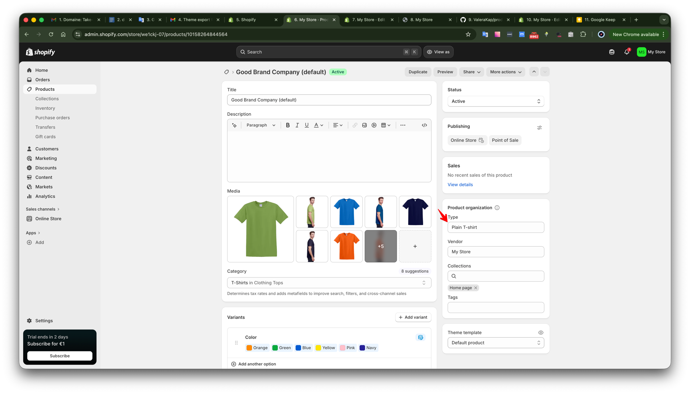

## Implemented User Stories

- Sale state: displays `On Sale!` badge and markdown price (`compare_at_price` + sale price).
- Variant swatches: hover previews a variant on desktop, and click switches/fixes variant imagery, URL, and pricing.
- Mobile swipe: horizontal swipe over the product image switches variants without tapping swatches.
- Variant hover image: hover over card image shows the secondary image for the selected variant.
- Product info: heading/brand line (`custom.card_brand` with fallback to `product.title`), title, and pricing are rendered on every card.

## Tech Stack

- Shopify Dawn (headed environment)
- Liquid snippets and blocks
- TailwindCSS (compiled to `assets/tailwind.css`)
- Vanilla JS module for client-side variant switching

## Styling Approach

- The card is built primarily with Tailwind utility classes in Liquid markup.
- A small set of reusable component classes is defined in `src/tailwind.css` (`@layer components`) and compiled into `assets/tailwind.css`.
- These classes are used for pixel-perfect Figma values, repeated style tokens, and stateful selectors/pseudo-elements (`:hover`, `:focus-visible`, active swatch ring, line clamp).
- This keeps the Liquid template cleaner and avoids overloading markup with long duplicated utility strings while still staying within a Tailwind workflow.

## Accessibility Notes

- Product images include non-empty `alt` fallbacks (`media alt -> product title -> localized fallback`).
- Swatch controls are implemented as real buttons with `aria-label` and `aria-pressed` state updates on selection.
- Swatch container uses labeled grouping (`role="group"` + `aria-label`) for screen-reader context.
- Sale badge interaction uses `aria-expanded` and tooltip visibility state (`aria-hidden`) updates.
- Keyboard focus states are explicitly styled via `focus-visible`.

## Local Setup

1. Install dependencies:
   `npm install`
2. Build Tailwind output:
   `npm run build:css`
3. Start Shopify theme dev server:
   `shopify theme dev --store=we1ckj-07.myshopify.com`

For active Tailwind development:
`npm run watch:css`

## Metafield Setup (Product)

- `custom.sale_badge_mode` (Single line text):
  - `default` -> badge follows sale logic (`compare_at_price > price`) + legacy `custom.sale_badge_enabled`
  - `force_show` -> always show badge
  - `force_hide` -> always hide badge

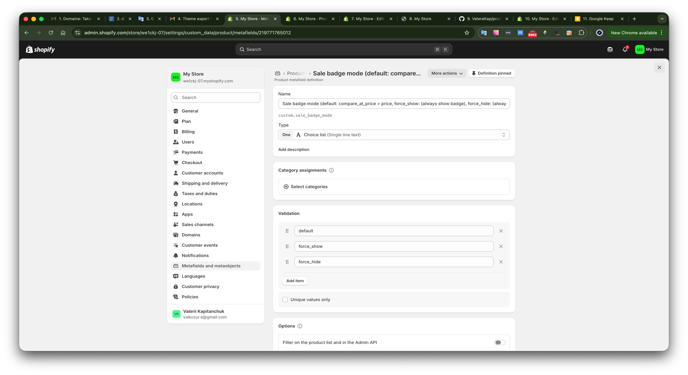

- `custom.sale_badge_text` (Single line text):
  - optional badge label override (falls back to localized default when empty)
- `custom.sale_badge_enabled` (Boolean):
  - legacy manual badge enable fallback used when mode is `default`

## Main Files Changed

- `snippets/assessment-product-card.liquid`
- `assets/assessment-product-card.js`
- `src/tailwind.css`
- `assets/tailwind.css`
- `snippets/stylesheets.liquid`
- `snippets/scripts.liquid`
- `blocks/_product-card.liquid`
- `blocks/product-card.liquid`

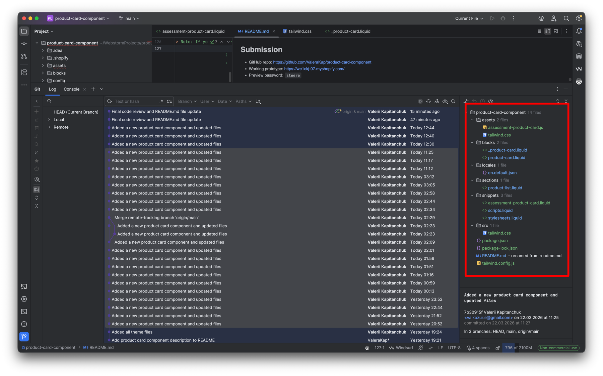

## Submission

- GitHub repo: https://github.com/ValeraKap/product-card-component
- Working prototype: https://we1ckj-07.myshopify.com/
- Preview password: `steere`

> Note: If you need any additional functionality or refinements, feel free to reach out. I am open to further iterations 💻.
